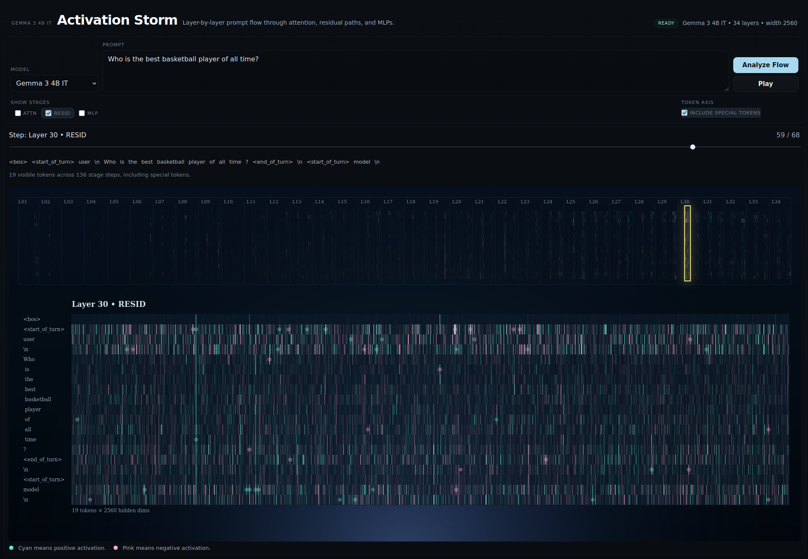

# Activation Storm



Activation Storm is a local browser app for visualizing activations from a prompt as they move through an LLM layer by layer.

You enter a prompt, run one forward pass, and inspect the flow across the network. The top band shows the full model at once. The lower panel shows the currently selected layer-stage slice as a `tokens x hidden_dim` field. The timeline moves through layer computation steps, not generated output tokens.

Right now only `google/gemma-3-4b-it` is supported.

For each layer, the app captures:
- `attn_out`
- `resid_after_attn`
- `mlp_out`
- `resid_after_mlp`

The UI supports:
- filtering by `Attn`, `Resid`, and `MLP`
- optionally including special/chat-wrapper tokens in the token axis
- stepping or playing through the captured layer-stage sequence

Setup:

```bash
python3 -m venv .venv
source .venv/bin/activate
pip install torch transformers
```

Run:

```bash
python -m src.activation_storm --host 127.0.0.1 --port 8000
```

Then open `http://127.0.0.1:8000`.

Notes:
- this visualizes activations only, not weights
- practical prompt length is still limited by model context and available memory
